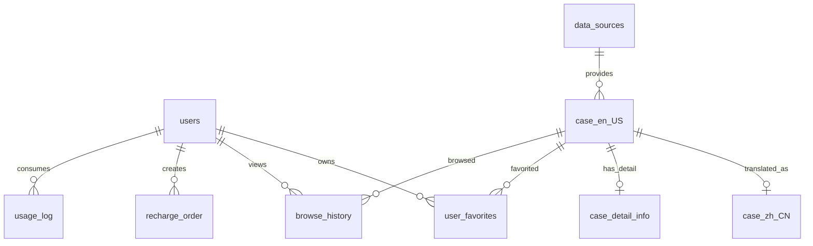

# 涉外案例 RAG 法律知识库问答助手数据库设计文档

## 1. 设计目标

本系统的主线是“涉外案例检索 + 本地知识库 RAG + 大模型问答”。数据库主要承担三类职责：

1. 存储用户、额度、收藏、浏览历史等业务数据。
2. 存储从爬虫和搜索流程沉淀下来的案例基础信息、原文链接和 AI 摘要。
3. 为 RAG 知识库提供可导入的数据来源，当前知识库索引文件由后端本地 JSON 维护，数据库保存可回灌的案例与摘要。

当前建表脚本位于 `legal_cases-master/src/main/resources/sql/`。

## 2. 核心实体关系

## 3. 表结构说明

### users

用户表，保存注册登录信息与摘要额度。

| 字段 | 类型 | 说明 |
| --- | --- | --- |
| user_id | BIGINT PK | 用户唯一 ID |
| username | VARCHAR(50) | 用户名，唯一 |
| password | VARCHAR(255) | 当前代码中为密码字段，后续建议改为哈希存储 |
| email | VARCHAR(100) | 邮箱，唯一 |
| registration_date | DATETIME | 注册时间 |
| last_login_date | DATETIME | 最近登录时间 |
| is_active | BOOLEAN | 账号是否启用 |
| summary_credits | INT | AI 摘要/问答额度 |
| insert_time / update_time | DATETIME | 创建与更新时间 |

索引：`idx_email`、`idx_username`。

### data_sources

数据源表，保存案例来源平台信息。

| 字段 | 类型 | 说明 |
| --- | --- | --- |
| source_id | INT PK | 数据源 ID |
| source_name | VARCHAR(100) | 数据源名称，如 CourtListener、EU、JPN |
| source_url | VARCHAR(255) | 来源站点地址 |
| source_country | VARCHAR(50) | 国家或地区 |
| insert_time / update_time | DATETIME | 创建与更新时间 |

索引：`idx_country`。

### case_en_US

英文案例基础信息表，也是案例主表。爬虫和搜索结果会先落到该表。

| 字段 | 类型 | 说明 |
| --- | --- | --- |
| pk | BIGINT PK | 自增主键 |
| case_id | VARCHAR(255) UNIQUE | 系统内案例 ID |
| source_id | INT | 数据源 ID |
| case_name | TEXT | 案例名称 |
| judgment_date | VARCHAR(255) | 裁判日期 |
| citation_count | INT | 引用次数 |
| summary | TEXT | 基础摘要 |
| original_document_url | TEXT | 官方原文 URL |
| insert_time / update_time | DATETIME | 创建与更新时间 |

索引：`idx_case_id`、`idx_judgment_date`。

### case_zh_CN

中文案例基础信息表，与 `case_en_US.case_id` 对应。当前实现中，中文表主要用于中文页面查询展示，部分字段可能直接复用英文数据或已有摘要。

| 字段 | 类型 | 说明 |
| --- | --- | --- |
| pk | BIGINT PK | 自增主键 |
| case_id | VARCHAR(255) | 关联英文案例 ID |
| source_id | INT | 数据源 ID |
| case_name | TEXT | 中文或原始标题 |
| judgment_date | VARCHAR(255) | 裁判日期 |
| citation_count | INT | 引用次数 |
| summary | TEXT | 摘要 |
| original_document_url | TEXT | 官方原文 URL |

外键：`case_id -> case_en_US(case_id)`。

### case_detail_info

案例详情与 AI 摘要表，是 RAG 回灌和案例阅读页的关键表。

| 字段 | 类型 | 说明 |
| --- | --- | --- |
| pk | BIGINT PK | 自增主键 |
| case_id | VARCHAR(255) | 案例 ID |
| content_zh_CN | LONGTEXT | 中文 AI 摘要或详情 |
| content_en_US | LONGTEXT | 英文 AI 摘要或详情 |
| summary_status | VARCHAR(32) | 异步摘要状态：PENDING/RUNNING/DONE/FAILED |
| summary_error | TEXT | 摘要失败原因 |
| summary_updated_at | DATETIME | 摘要状态更新时间 |
| insert_time / update_time | DATETIME | 创建与更新时间 |

外键：`case_id -> case_en_US(case_id)`。

### user_favorites

用户收藏表。

| 字段 | 类型 | 说明 |
| --- | --- | --- |
| favorite_id | BIGINT PK | 收藏记录 ID |
| user_id | BIGINT | 用户 ID |
| case_id | VARCHAR(255) | 案例 ID |
| custom_name | VARCHAR(255) | 用户自定义名称 |
| tags | VARCHAR(255) | 用户标签 |
| favorite_date | DATETIME | 收藏时间 |

唯一约束：`unique_user_case(user_id, case_id)`。

### browse_history

浏览历史表。

| 字段 | 类型 | 说明 |
| --- | --- | --- |
| history_id | BIGINT PK | 历史记录 ID |
| user_id | BIGINT | 用户 ID |
| case_id | VARCHAR(255) | 案例 ID |
| browse_time | DATETIME | 浏览时间 |

唯一约束：`uk_user_case(user_id, case_id)`，用于同一用户同一案例只保留一条浏览记录并更新时间。

### usage_log

用量日志表，用于记录摘要、问答等消耗额度的行为。

| 字段 | 类型 | 说明 |
| --- | --- | --- |
| id | BIGINT PK | 日志 ID |
| user_id | BIGINT | 用户 ID |
| case_id | VARCHAR(255) | 案例 ID，可为空 |
| action_type | VARCHAR(64) | 操作类型 |
| created_at | DATETIME | 创建时间 |

索引：`idx_user_created(user_id, created_at)`。

### recharge_order

充值订单表，支持 mock 支付和 Stripe 支付骨架。

| 字段 | 类型 | 说明 |
| --- | --- | --- |
| id | BIGINT PK | 订单 ID |
| order_no | VARCHAR(64) UNIQUE | 业务订单号 |
| user_id | BIGINT | 用户 ID |
| package_id | VARCHAR(32) | 套餐 ID |
| credits | INT | 增加额度 |
| amount_cents | INT | 金额，分 |
| currency | VARCHAR(8) | 币种，默认 cny |
| status | VARCHAR(16) | PENDING/PAID/CANCELLED/FAILED |
| channel | VARCHAR(16) | MOCK/STRIPE |
| stripe_session_id | VARCHAR(255) | Stripe session |
| stripe_payment_intent | VARCHAR(255) | Stripe payment intent |
| created_at / paid_at | TIMESTAMP | 创建与支付时间 |
| remark | VARCHAR(512) | 备注 |

## 4. RAG 流程中的数据流

1. 用户在前端或 Agent 接口提交法律问题。
2. Agent 可选择调用案例搜索，后端通过爬虫或缓存获取案例列表，并写入 `case_en_US`、`case_zh_CN`。
3. 用户打开案例或触发摘要时，后端抓取原文并生成摘要，写入 `case_detail_info`。
4. 知识库入库接口可从数据库、手工文本或爬虫结果生成本地 KB 切片索引。
5. Agent 调用本地 KB 查询接口，返回答案、命中切片和检索 trace。

## 5. 当前边界与后续建议

- 当前 KB 索引不在 MySQL 中，而是在后端本地 JSON 文件中维护，适合本周演示和轻量部署。
- 当前未单独设计 `kb_document`、`kb_chunk`、`embedding` 表；如果后续要生产化，建议增加这些表或接入向量数据库。
- 当前密码字段在代码中按明文比较，数据库设计上保留 `password` 字段，但后续应改为 `password_hash`。
- 当前案例日期使用字符串保存，后续如果要做稳定筛选和统计，建议增加标准化 `judgment_date_value DATE` 字段。
