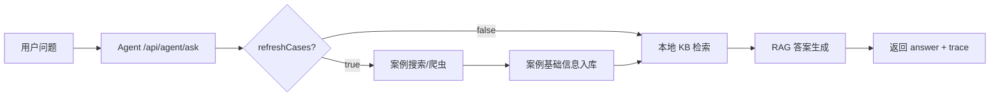

# 本周核心流程交付说明

## 1. 老师要求对应

本周要求是“核心流程跑通，agent，爬虫，大模型训练，算法等，并提交数据库设计文档”。本项目主线是 RAG 法律知识库问答助手，没有单独算法模块，因此本周交付按下面方式对应：

| 要求 | 本周处理 |
| --- | --- |
| 核心流程跑通 | 搜索/爬虫 -> 案例入库 -> KB 查询 -> Agent 问答 |
| Agent | 新增轻量接口 `/api/agent/ask` |
| 爬虫 | 复用现有 US/EU/JPN 搜索与详情爬虫配置，补 MacOS/脚本说明 |
| 大模型训练 | 不做微调训练，采用“大模型接入 + RAG 检索增强”作为本周可演示能力 |
| 算法 | 当前项目无独立算法，本周不额外造算法模块 |
| 数据库设计文档 | 已补 `docs/数据库设计文档.md` |

## 2. 新增 Agent 接口

接口：

```http
POST /api/agent/ask
Content-Type: application/json
```

示例请求：

```json
{
  "userId": 1,
  "question": "forum selection clause",
  "language": "zh",
  "sources": "US",
  "period": 3,
  "topK": 5,
  "refreshCases": true
}
```

字段说明：

| 字段 | 说明 |
| --- | --- |
| question | 用户法律问题 |
| language | 返回语言，默认 `zh` |
| sources | 可选数据源，如 `US,EU,JPN` |
| period | 可选时间范围 |
| topK | KB 检索条数，限制在 1-10 |
| refreshCases | 是否先触发案例搜索/爬虫链路 |

返回内容包含：

- `answer`：RAG 回答。
- `route`：`rag_only` 或 `search_then_rag`。
- `searchTotalCount`：案例搜索命中数。
- `kbHitCount`：知识库命中数。
- `relatedCases`：相关案例。
- `kbHits`：知识库命中切片。
- `trace`：Agent 执行过程，便于课堂演示。

## 3. 核心流程



## 4. 代码改动

新增后端文件：

- `legal_cases-master/src/main/java/com/hnu/legal_cases/dto/agent/AgentAskReqVO.java`
- `legal_cases-master/src/main/java/com/hnu/legal_cases/dto/agent/AgentAskResVO.java`
- `legal_cases-master/src/main/java/com/hnu/legal_cases/service/LegalAgentService.java`
- `legal_cases-master/src/main/java/com/hnu/legal_cases/service/impl/LegalAgentServiceImpl.java`
- `legal_cases-master/src/main/java/com/hnu/legal_cases/controller/AgentController.java`

新增测试：

- `legal_cases-master/src/test/java/com/hnu/legal_cases/service/impl/LegalAgentServiceImplTest.java`

构建环境修正：

- `legal_cases-master/pom.xml`
  - Spring AI BOM 从旧 snapshot 调整为稳定版 `1.0.6`，避免依赖下载不稳定。
  - 显式配置 Lombok annotation processor，解决 JDK 23 下 Lombok 不自动生效导致的命令行编译失败。

## 5. 演示路径

1. 启动 MySQL、Redis、后端和可用爬虫服务。
2. 通过 `/api/kb/ingest`、`/api/kb/ingest-crawler` 或 `/api/kb/ingest-db` 导入知识库。
3. 访问 `/api/agent/ask`：
   - `refreshCases=false`：快速演示本地 RAG 问答。
   - `refreshCases=true`：演示先搜索/爬虫，再问答的完整流程。
4. 查看返回的 `trace`，说明 Agent 执行了 plan、case_search、kb_retrieve、answer 等步骤。

## 6. 当前边界

- Agent 是轻量编排层，不是复杂多轮规划 Agent。
- KB 仍使用现有本地 JSON 索引和 hash embedding，不是生产级向量数据库。
- 韩国数据源尚未实现；当前主要支持 US/EU/JPN。
- 小程序端仍是 mock 数据，未接入新增 Agent 接口。
- 本周不做大模型微调训练，只交付可运行的大模型 RAG 问答流程。
